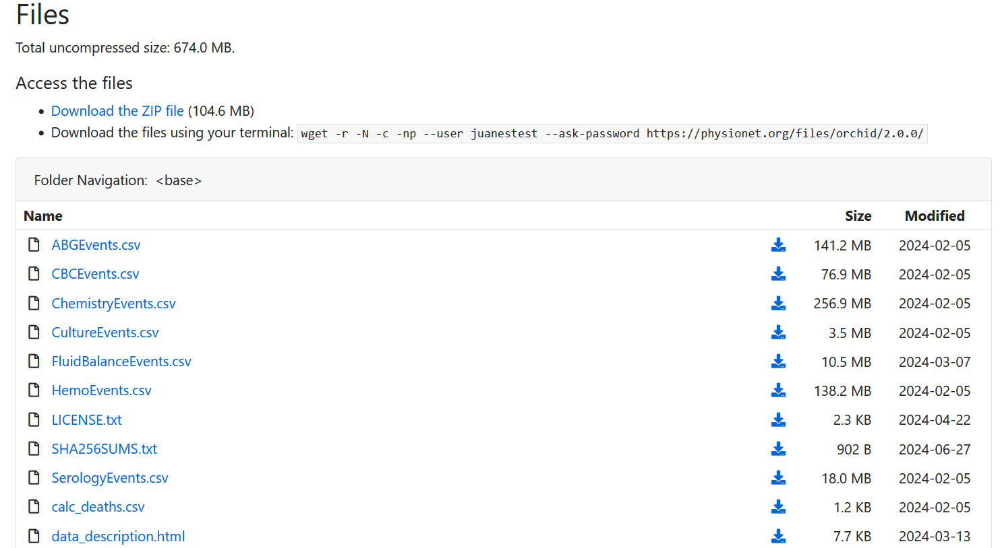

# health-project-mlops

Estimating Time from Referral to Procurement using Organ Retrieval and Collection of Health Information for Donation from [physionet.org](https://doi.org/10.13026/b1c0-3506).
This project is linked with mlops datatalks first attempt to [MLOps Zoomcamp](https://github.com/DataTalksClub/mlops-zoomcamp) 2024 course!.

# Estimating Time from Referral to Procurement
## Objective
The goal of this project is to predict the time interval between hospital referral and organ procurement using a machine learning model. This helps healthcare professionals estimate the procurement timeline, potentially improving the efficiency and planning of organ transplants.

## Features Used

We selected the following features to train our model, a description in deep is in html file or [physionet.org](https://doi.org/10.13026/b1c0-3506):

- Age: The age of the patient. (Numerical)
- Gender: The gender of the patient. (Categorical)
- Race: The race of the patient. (Categorical)
- HeightIn: The height of the patient in inches. (Numerical)
- WeightKg: The weight of the patient in kilograms. (Numerical
- blood_type: A combination of the ABO Blood Type and the Rh factor (positive or negative). (Categorial)
- brain_death: A boolean indicating if brain death has occurred. (Categorical)

## Target Variable

The target variable, time_to_procurement, is calculated as the difference between time_procured and time_referred, converted into hours. The Random Forest model was chosen for its ability to handle complex, non-linear relationships and interactions among features. The model's performance was evaluated using metrics like Mean Absolute Error (MAE) and Root Mean Squared Error (RMSE). Feature importance was visualized to understand the contribution of each feature to the model's predictions.

## Model Used

We used a Random Forest regression model for this task.

# Load data
This are the steps to follow in order to update credential access or cookies for the project to run propertly. this project has two ways of loading data. The first is by using a Cookie and updating you credenitals in the docker compose file, the second is updating your credenitals in the docker compose file. Both cases you need to sign up and generate credentials. Below I explain how to do it: 

1. go to the link [physionet.org](https://doi.org/10.13026/b1c0-3506) and click on Account on the upper-right corner of the screen. 
2. fill the information with a valid email
3. check you email inbos/junk/spam an email from noreply@physionet.org. Click on the link to activate your account. 
4. you will be asked for update your password. after you generate your password, click on "Activate" buttom. 
5. sign in with your credentials and go to this page [physionet.org](https://
doi.org/10.13026/b1c0-3506)
6. go to the buttom of the page and click on the link that says "sign the data use agreement for the project"
7. click on "Agree"
8. click on the link to go to the dataset or click here [physionet.org](https://doi.org/10.13026/b1c0-3506)
9. go to the buttom of the page and you will see this: 




The next steps depends on what method you would use to download the data. I list here two main methods, the first is collecting a Cookie from a download from physionet website for only the data used. The second, is simply update the credentials in the docker compose file on root. 
The following steps are the steps needed to run the pipelines and download the data successfully:

## Get Cookie Env Variable
1. in order to download the data and get the Cookie, press F12 (or inspect element with right-click) go to "network" panel and click on download "referrals.csv"
2. one csv file is downloaded, right-click on GET method that you should see on the network panel if you follow step 10. Then click on "copy cURL"
3. use any cURL of your preference like ["Postman"](https://www.postman.com/). I suggest [convert](https://curlconverter.com/) to convert the cURL in a python script. 
4. copy cookie and replace the new cookie on the docker compose env

## update user and password
1. open docker-compose.yml and update PHYSIONET_USERNAME and PHYSIONET_PASSWORD with your credentials. Do not include any aditional character. 


# project run 
On this project you could upload to a cloud using docker compose up with the docker-compose.yml file on root directory. To run it locally you need a docker running on you machine and run the following comand: 

```batch
docker-compose up --build
```

# Best practices

## linting and formatting
In case you want to check formating or linting you can use the following commands:

```batch
pylint src/
black src/
isort src/
```
The pylint code passed with 10/10 and black and isort do not suggest any changes
